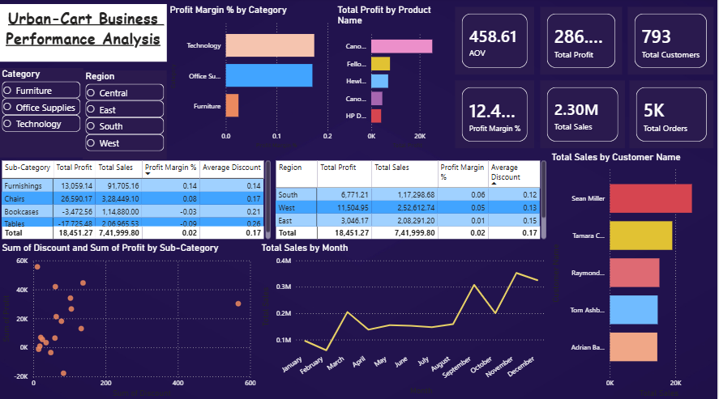

# 📊 UrbanCart Business Performance Analysis Dashboard

## Project Overview

This project analyzes retail sales performance, profitability, customer behavior, and discount impact using Power BI.

The objective was to identify key business drivers affecting profitability and provide actionable recommendations through data-driven insights.

---

## Dashboard Preview

---

## Business Problem

Despite generating substantial revenue, management wanted to understand:

- Which categories contribute the most profit?
- Which regions are underperforming?
- Does discounting negatively impact profitability?
- Which products and customer segments drive business growth?

---

## Tools Used

- Power BI
- Power Query
- DAX
- Data Modeling
- Data Visualization

---

## Key KPIs

- Total Sales
- Total Profit
- Profit Margin %
- Total Orders
- Total Customers
- Average Order Value (AOV)
- Average Discount
- Profit per Order

---

## Dashboard Features

### Executive KPI Section

- Total Sales
- Total Profit
- Total Orders
- Total Customers
- Profit Margin %
- AOV

### Trend Analysis

- Monthly Sales Trend
- Monthly Profit Trend

### Regional Analysis

- Sales by Region
- Profit by Region

### Category Analysis

- Sales by Category
- Profit by Category
- Profit Margin by Category

### Product Analysis

- Top 10 Products by Profit

### Discount Impact Analysis

- Discount vs Profit Scatter Plot

### Interactive Filters

- Region Slicer
- Category Slicer

---

## Key Business Insights

### 1. Technology was the strongest-performing category

- Generated the highest sales and profit.
- Maintained healthy profit margins.

### 2. Furniture was significantly underperforming

- Contributed high revenue but very low profitability.
- Overall profit margin was only 2%.

### 3. Tables and Bookcases were loss-making

- Tables operated at a negative profit margin of -9%.
- Bookcases operated at a negative profit margin of -3%.

### 4. Central Region required immediate attention

- Generated negative profit margins.
- Had the highest average discount levels.

### 5. Higher discounts reduced profitability

- Strong inverse relationship observed between discount rates and profit margins.

---

## Recommendations

### Short-Term

- Review discount policies in the Central region.
- Reduce excessive discounting on Tables and Bookcases.

### Long-Term

- Increase investment in Technology products.
- Expand successful strategies used in South and West regions.
- Implement profitability monitoring for high-discount products.

---

## Skills Demonstrated

- Data Cleaning using Power Query
- Data Modeling
- DAX Measure Creation
- KPI Development
- Business Analysis
- Root Cause Analysis
- Dashboard Design
- Data Storytelling

---

## Dataset

Retail sales dataset containing:

- Orders
- Customers
- Products
- Categories
- Regions
- Discounts
- Sales
- Profit

---

## Author

**Mayank Srivastava**

Aspiring Data Analyst | Power BI | SQL | Python | Machine Learning

LinkedIn: https://www.linkedin.com/in/ms8960

GitHub: https://github.com/ms00000ms0000
